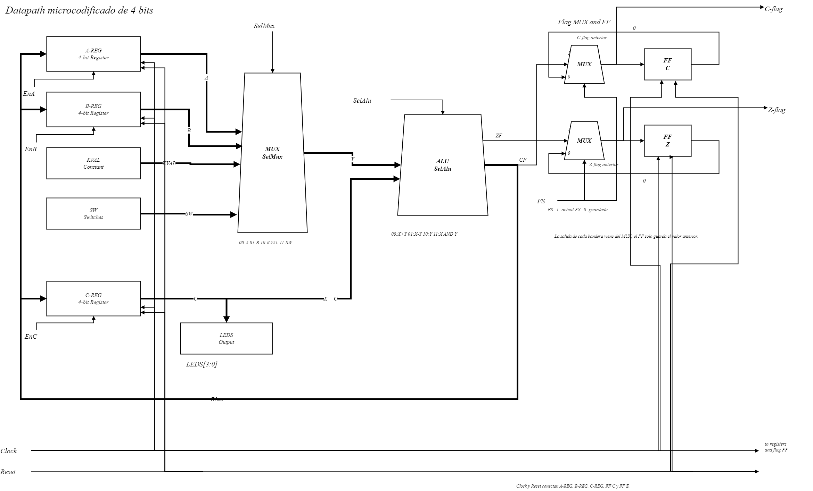
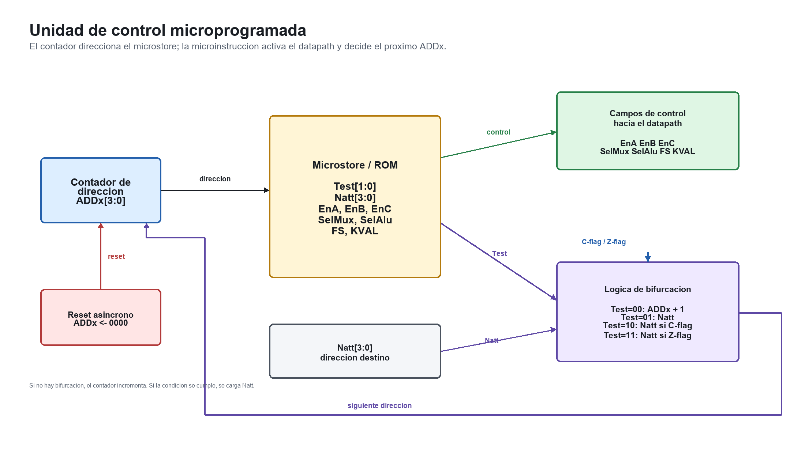

# Proyecto uProcesadores

Implementacion en Verilog de una trayectoria de datos microcodificada de 4 bits, con unidad de control, ALU, registros, banderas y testbench para ModelSim.

El proyecto esta organizado por modulos para que cada parte del sistema se pueda explicar y verificar por separado: datapath, ALU, registros, banderas, microstore y unidad de control.

## Resumen

El sistema ejecuta un microprograma almacenado en una ROM de control. En cada ciclo, la direccion `ADDx` selecciona una microinstruccion dentro del `microstore`. Esa microinstruccion genera las senales que controlan el datapath:

- que registros cargan datos
- que entrada entra al MUX
- que operacion realiza la ALU
- si las banderas se actualizan o se usa el valor guardado
- si la siguiente direccion es secuencial o por salto

La entrada externa es `SW[3:0]` y la salida principal es `LEDS[3:0]`, que muestra el contenido del registro `C`.

## Arquitectura general

El proyecto se divide en dos bloques principales:

| Bloque | Funcion |
|---|---|
| Datapath | Procesa y almacena datos usando registros, MUX, ALU y banderas. |
| Unidad de control | Lee el microcodigo y genera las senales de control para el datapath. |

### Datapath

El datapath contiene:

- registros `A`, `B` y `C`
- MUX de 4 entradas para seleccionar la entrada `Y` de la ALU
- ALU de 4 bits
- banderas `C-flag` y `Z-flag`
- salida `LEDS[3:0]` conectada al registro `C`



La salida de la ALU, `Z`, regresa a los registros `A`, `B` y `C`. Sin embargo, no todos cargan al mismo tiempo: cada registro tiene su propia senal de habilitacion (`EnA`, `EnB`, `EnC`).

### Unidad de control

La unidad de control usa un contador de direccion `ADDx` para apuntar a la microinstruccion actual. La ROM de microcodigo entrega los campos de control y la logica de salto decide la proxima direccion.



Campos principales de control:

| Campo | Funcion |
|---|---|
| `EnA`, `EnB`, `EnC` | Habilitan la carga de los registros A, B y C. |
| `SelMux` | Selecciona la entrada `Y` de la ALU. |
| `SelAlu` | Selecciona la operacion de la ALU. |
| `FS` | Selecciona bandera actual o bandera guardada. |
| `KVAL` | Constante de 4 bits usada por el datapath. |
| `TEST` | Define la condicion de salto. |
| `NATT` | Direccion destino cuando se toma un salto. |

## Modulos Verilog

| Archivo | Descripcion |
|---|---|
| `rtl/register4.v` | Registro de 4 bits con reset asincrono y enable. |
| `rtl/mux4.v` | MUX 4 a 1 para seleccionar la entrada `Y` de la ALU. |
| `rtl/alu4.v` | ALU de 4 bits con suma, resta, paso de `Y` y AND. |
| `rtl/flag_registers.v` | Registro y seleccion de banderas `C` y `Z`. |
| `rtl/datapath.v` | Integra registros, MUX, ALU y banderas. |
| `rtl/microstore.v` | ROM de microcodigo. |
| `rtl/control_unit.v` | Contador de direccion y logica de bifurcacion. |
| `rtl/proyecto_microcodificado_top.v` | Modulo superior del proyecto. |
| `tb/tb_proyecto_microcodificado.v` | Testbench para ModelSim. |
| `sim/modelsim.do` | Script para compilar, simular y agregar senales al Wave. |

## Microcodigo implementado

```text
0000 Start: C <- F
0001 GetSW: A, B <- SW
0010        B, C <- C - A; if Z-flag* goto Start
0011        C <- A
0100 Top:   C <- C + 1
0101        C - B; if C-flag goto Top
0110        goto Start
```

`Z-flag*` indica que se usa la bandera `Z` guardada previamente. Esto permite que el estado `S2` tome la decision con base en el valor leido en `S1`.

## Tabla de control

| Dir | TEST | NATT | EnA | EnB | EnC | SelMux | SelAlu | FS | KVAL | Microoperacion |
|---|---|---|---|---|---|---|---|---|---|---|
| `0000` | `00` | `0000` | `0` | `0` | `1` | `10` | `10` | `0` | `1111` | `C <- F` |
| `0001` | `00` | `0000` | `1` | `1` | `0` | `11` | `10` | `1` | `0000` | `A,B <- SW` |
| `0010` | `11` | `0000` | `0` | `1` | `1` | `00` | `01` | `0` | `0000` | `B,C <- C - A; if Z* goto Start` |
| `0011` | `00` | `0000` | `0` | `0` | `1` | `00` | `10` | `0` | `0000` | `C <- A` |
| `0100` | `00` | `0000` | `0` | `0` | `1` | `10` | `00` | `0` | `0001` | `C <- C + 1` |
| `0101` | `10` | `0100` | `0` | `0` | `0` | `01` | `01` | `1` | `0000` | `C - B; if C goto Top` |
| `0110` | `01` | `0000` | `0` | `0` | `0` | `00` | `00` | `0` | `0000` | `goto Start` |

## Simulacion en ModelSim

### Opcion recomendada

Abrir ModelSim y ejecutar:

```tcl
do {C:/Users/josaf/OneDrive/Documents/VII Semestre/05_uProcesadores/07_Proyecto/sim/modelsim.do}
```

El script:

1. crea la libreria `work`
2. compila todos los modulos Verilog
3. carga el testbench
4. agrega las senales importantes al Wave con nombres legibles
5. ejecuta la simulacion completa

### Senales recomendadas para revisar

- `Clock`
- `Reset`
- `SW[3:0]`
- `ADDx`
- `Reg A`
- `Reg B`
- `Reg C`
- `Z flag`
- `C flag`
- `Branch tomado`
- `TEST`
- `NATT`
- `SelMux`
- `SelAlu`
- `FS`
- `KVAL`

## Evidencia de simulacion

Salida de consola:


Ventana Wave:


## Documentacion

La explicacion completa del proyecto esta en:

- `docs/Informe_funcionamiento_proyecto_actualizado.docx`
- `Proyecto_2026.pdf`

Tambien se incluyen diagramas editables en:

- `docs/drawio/datapath_profesor_style_full_flags.drawio`

## Estructura del repositorio

```text
.
|-- rtl/
|   |-- register4.v
|   |-- mux4.v
|   |-- alu4.v
|   |-- flag_registers.v
|   |-- datapath.v
|   |-- microstore.v
|   |-- control_unit.v
|   `-- proyecto_microcodificado_top.v
|-- tb/
|   `-- tb_proyecto_microcodificado.v
|-- sim/
|   `-- modelsim.do
|-- docs/
|   |-- figures/
|   |-- drawio/
|   `-- Informe_funcionamiento_proyecto_actualizado.docx
|-- Out.png
|-- Wave.png
|-- Proyecto_2026.pdf
`-- README.md
```

## Resultado esperado

Durante la simulacion se observa que:

- con `SW = 0000`, el programa detecta `Z-flag*` y regresa a `Start`
- con `SW = 0100`, el programa avanza por el microprograma
- `ADDx` muestra la direccion actual del microcodigo
- `LEDS` muestra el contenido del registro `C`
- `Branch tomado` se activa cuando la unidad de control toma una bifurcacion

La ultima corrida de verificacion en ModelSim compilo y simulo con:

```text
Errors: 0, Warnings: 0
```
