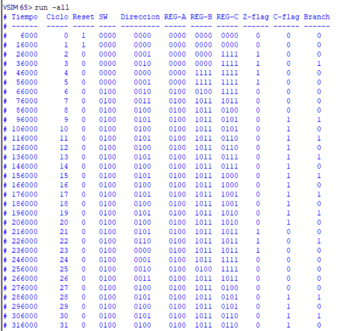
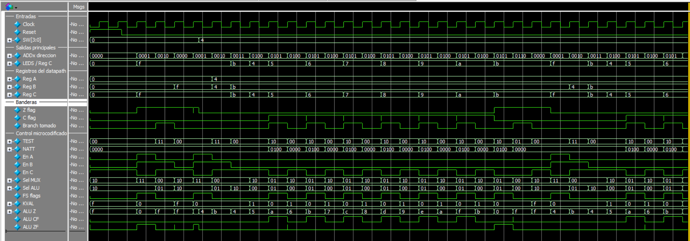

# Proyecto uProcesadores

Implementacion en Verilog de una trayectoria de datos microcodificada de 4 bits. El proyecto esta organizado por modulos para poder explicar y probar cada parte por separado: registros, MUX, ALU, banderas, datapath, microstore y unidad de control.

La simulacion principal esta preparada para ModelSim y tambien se agrego un `top` especial para implementar el diseno en la Tang Nano 9K usando Gowin.

## Resumen del sistema

El sistema ejecuta un microprograma almacenado en una ROM de control (`microstore`). En cada ciclo, la direccion `ADDx` selecciona una microinstruccion. Esa microinstruccion genera las senales de control para el datapath:

- habilitacion de registros `A`, `B` y `C`
- seleccion de entrada del MUX
- operacion de la ALU
- actualizacion o conservacion de banderas
- seleccion de la siguiente direccion del microprograma

La entrada de datos es `SW[3:0]`. La salida principal es `LEDS[3:0]`, que representa el contenido del registro `C`.

## Estructura

```text
.
|-- rtl/
|   |-- register4.v
|   |-- mux4.v
|   |-- alu4.v
|   |-- flag_registers.v
|   |-- datapath.v
|   |-- microstore.v
|   |-- control_unit.v
|   |-- proyecto_microcodificado_top.v
|   `-- gowin_tangnano9k_top.v
|-- tb/
|   `-- tb_proyecto_microcodificado.v
|-- sim/
|   `-- modelsim.do
|-- docs/
|   |-- figures/
|   `-- drawio/
|-- tangnano9k_template.cst
|-- Out.png
|-- Wave.png
`-- README.md
```

## Modulos Verilog

| Archivo | Funcion |
|---|---|
| `rtl/register4.v` | Registro sincronico de 4 bits con reset y enable. |
| `rtl/mux4.v` | MUX 4 a 1 para seleccionar la entrada `Y` de la ALU. |
| `rtl/alu4.v` | ALU de 4 bits con suma, resta, paso de `Y` y AND. |
| `rtl/flag_registers.v` | Manejo de banderas `C` y `Z`. |
| `rtl/datapath.v` | Integra registros, MUX, ALU y banderas. |
| `rtl/microstore.v` | ROM de microcodigo. |
| `rtl/control_unit.v` | Contador de microdireccion y logica de salto. |
| `rtl/proyecto_microcodificado_top.v` | Top general usado para simulacion. |
| `rtl/gowin_tangnano9k_top.v` | Top para implementar en Tang Nano 9K. |
| `tb/tb_proyecto_microcodificado.v` | Testbench para ModelSim. No se usa en Gowin. |

## Microcodigo implementado

```text
0000 Start: C <- F
0001 GetSW: A, B <- SW
0010        B, C <- C - A; if Z-flag* goto Start
0011        C <- A
0100 Top:   C <- C + 1
0101        C - B; if C-flag goto Top
0110        goto Start
```

`Z-flag*` indica que la unidad de control usa la bandera `Z` guardada previamente.

## Simulacion en ModelSim

Desde ModelSim, ejecutar:

```tcl
do sim/modelsim.do
```

Si ModelSim no esta abierto en la carpeta raiz del proyecto, tambien se puede ejecutar el mismo archivo usando su ruta completa local. El script calcula automaticamente las carpetas `rtl`, `tb` y `sim/work`.

El script crea la libreria `work`, compila todos los modulos, carga el testbench, agrega las senales principales al Wave y corre la simulacion.

Senales recomendadas para revisar:

- `Clock`
- `Reset`
- `SW[3:0]`
- `ADDx`
- `Reg A`
- `Reg B`
- `Reg C`
- `Z flag`
- `C flag`
- `Branch tomado`
- `TEST`
- `NATT`
- `SelMux`
- `SelAlu`
- `FS`
- `KVAL`

Evidencias:





## Implementacion en Gowin para Tang Nano 9K

Para implementar el proyecto en Gowin, se debe usar el top especial:

```text
gowin_tangnano9k_top
```

Este modulo adapta el proyecto a la placa:

- entrada de reloj: `sys_clk`
- reset activo en bajo: `sys_rst_n`
- entrada de datos: `sw[3:0]`
- salida visible: `led[3:0]`

El wrapper tambien divide el reloj onboard de 27 MHz usando `clk_div[23]`, para que el avance del microprograma sea visible en los LEDs. Si se quisiera correr a velocidad completa, se puede cambiar en `gowin_tangnano9k_top.v` la conexion `.Clock(core_clk)` por `.Clock(sys_clk)`.

Los LEDs onboard de la Tang Nano 9K son activos en bajo. Por eso el wrapper invierte la salida:

```verilog
assign led = ~leds_internal;
```

### Archivos que se agregan a Gowin

Agregar estos archivos Verilog al proyecto de Gowin:

```text
rtl/register4.v
rtl/mux4.v
rtl/alu4.v
rtl/flag_registers.v
rtl/datapath.v
rtl/microstore.v
rtl/control_unit.v
rtl/proyecto_microcodificado_top.v
rtl/gowin_tangnano9k_top.v
```

No agregar estos archivos a Gowin:

```text
tb/tb_proyecto_microcodificado.v
sim/modelsim.do
```

### Pasos en Gowin

1. Crear un proyecto nuevo: `File > New > FPGA Design Project`.
2. Seleccionar la familia/dispositivo de la Tang Nano 9K: `GW1NR-9`, package `QN88`. Si Gowin muestra variantes de velocidad, seleccionar la que corresponda a la placa.
3. Agregar los `.v` listados arriba.
4. Definir como top module: `gowin_tangnano9k_top`.
5. Agregar o crear el archivo de constraints usando `tangnano9k_template.cst`.
6. Completar los pines de `sw[3:0]` segun donde se conecten las cuatro entradas externas.
7. Ejecutar `Synthesize`.
8. Ejecutar `Place & Route`.
9. Abrir `Programmer` y descargar a SRAM para probar rapidamente, o a Flash si se quiere que quede guardado.

Si Gowin muestra un error tipo `PR2017`, revisar en la configuracion de Place & Route la opcion de pines de doble proposito, especialmente `Use DONE as regular IO`, como se muestra en los ejemplos de Sipeed.

### Archivo CST

La plantilla incluida esta en:

```text
tangnano9k_template.cst
```

Pines ya incluidos:

| Senal | Pin |
|---|---:|
| `sys_clk` | `52` |
| `sys_rst_n` | `4` |
| `led[0]` | `10` |
| `led[1]` | `11` |
| `led[2]` | `13` |
| `led[3]` | `14` |

Falta completar:

```text
sw[0]
sw[1]
sw[2]
sw[3]
```

La Tang Nano 9K no tiene cuatro switches dedicados, asi que esas entradas se deben conectar a pines externos, botones externos, jumpers o algun modulo de entrada.

## Documentacion incluida

El repositorio mantiene los archivos fuente, diagramas y evidencias necesarias para revisar el proyecto. Los informes `.docx`, `.pdf` y el enunciado original se dejan como archivos locales porque pueden contener datos personales o material de clase.

Diagramas versionados:

```text
docs/drawio/datapath_profesor_style_full_flags.drawio
docs/drawio/datapath_profesor_style_full_flags.drawio.png
docs/figures/control_unit.png
docs/figures/asm_chart.png
```

## Resultado esperado

En simulacion se observa que:

- con `SW = 0000`, el programa detecta la bandera `Z` y regresa a `Start`
- con `SW = 0100`, el microprograma recorre los estados principales
- `ADDx` muestra la direccion actual del microcodigo
- `LEDS` muestra el registro `C`
- `Branch tomado` se activa cuando la unidad de control toma una bifurcacion

En la Tang Nano 9K, los LEDs muestran el registro `C` de forma visible gracias al divisor de reloj del wrapper de Gowin.

## Referencias utiles

- Sipeed Tang Nano 9K: https://wiki.sipeed.com/hardware/en/tang/Tang-Nano-9K/Nano-9K
- Tutorial LED en Gowin: https://wiki.sipeed.com/hardware/en/tang/Tang-Nano-9K/examples/led.html
